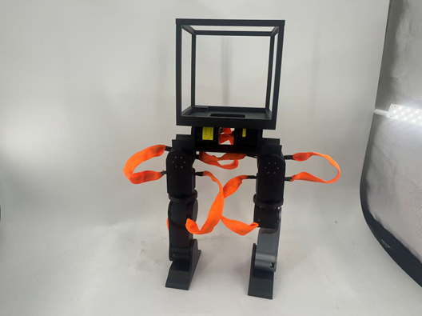

This is the English version of your README. I have integrated the video path as requested and optimized the terminology to align with international robotics projects (like Unitree or Stanford ALOHA).

---

# OpenZero: A Low-cost, High-performance Open-source Humanoid Robot

<div align="center">
  <!-- Image placeholder -->
  
  <p><b>A 40cm-class open-source humanoid platform for educational training and algorithm verification.</b></p>
</div>

[](https://opensource.org/licenses/MIT)
[](https://www.python.org/)
[](https://developer.nvidia.com/isaac-gym)

**OpenZero** is a lightweight humanoid robot designed specifically for developers, researchers, and higher education. It features a fully 3D-printed structure powered by high-performance Damiao planetary actuators. The project provides a complete software toolchain, spanning from Reinforcement Learning (RL) in NVIDIA Isaac Lab to cross-engine validation in MuJoCo (Sim2Sim).

---

## ✨ Key Features

- **High-Performance Actuators**: Equipped with 10x **Damiao 4340** joint motors, delivering a peak torque of **27Nm** for high-dynamic motion control.
- **Standardized 10-DOF**: The lower body utilizes a mainstream 10-degree-of-freedom design (Hip 3 + Knee 1 + Ankle 1), ensuring seamless compatibility with state-of-the-art academic algorithms.
- **Rapid Maintenance Ecosystem**: With a 100% 3D-printed chassis, any damaged part can be reprinted and replaced within **8 hours**, significantly reducing hardware risks during the Sim2Real transition.
- **Advanced Training Framework**: Built on **NVIDIA Isaac Lab**, supporting PPO algorithms and integrated Domain Randomization to enhance gait robustness.
- **Sim2Sim Validation**: A unique cross-engine validation workflow from Isaac Lab to MuJoCo, ensuring the algorithm is verified across multiple physics environments before physical deployment.
  
  ### Sim2Sim Validation

A unique cross-engine validation workflow from Isaac Lab to MuJoCo, ensuring the algorithm is verified across multiple physics environments before physical deployment.

<div align="center">
  <video src="docs/assets/sim2sim.mp4" width="600" controls muted autoplay loop></video>
  <p><i>Sim2Sim: Isaac Lab to MuJoCo Verification</i></p>
</div>

---

## 🛠️ Hardware Specifications

### 1. Mechanical Structure

| Parameter | Specification | Remarks |
| :--- | :--- | :--- |
| **Height** | 40 cm | Lightweight and portable |
| **DOF** | 10 (Lower Body) | Hip(P/Y/R), Knee(P), Ankle(P) |
| **Material** | Full 3D Printed | Recommended: PA12-GF or High-Performance Resin |
| **Communication**| USB to CAN | High-speed real-time control link |

### 2. Electronics

- **Actuators**: 10x **Damiao 4340** Planetary Motors (9Nm Rated, 27Nm Peak).
- **IMU**: 200Hz high-refresh-rate Inertial Measurement Unit.
- **Controller**: Supports external PC or embedded hosts (e.g., NVIDIA Jetson Orin Nano).

---

## 💻 Software Stack

The project provides a comprehensive control architecture:

1. **Simulation & Training (Isaac Lab)**:
   - Standardized workflow: Model Import -> Env Config -> Reward Design -> Policy Convergence.
   - **PPO Algorithm**: Optimized for motion completion, postural stability, and energy efficiency.
2. **Physics Verification (Sim2Sim)**:
   - Cross-platform verification using the **MuJoCo** physics engine.
   - Identifies discrepancies between simulation environments to minimize real-world hardware damage.
3. **Future Extensions**: Planned integration for AMP (Adversarial Motion Priors), Beyond Mimic, and GMR (General Motion Retargeting).

---

## 🚀 Quick Start

### 1. Clone the Repository

```bash
git clone https://github.com/YourUsername/OpenZero.git
cd OpenZero
```

### 2. Environment Setup

Please ensure you have the NVIDIA Driver and Isaac Lab installed. For detailed step-by-step instructions, please refer to our Bilibili video tutorials.

### 3. Running Simulation

```bash
# Please refer to the video tutorials for detailed parameter configuration
python scripts/train.py --task OpenZero_Walk
```

---

## 📚 Educational Resources

OpenZero is more than just a repository; it is a complete **educational ecosystem** including:

- Linux Fundamentals & URDF Model Exporting.
- Introduction to RL with Isaac Lab.
- PPO Algorithm Breakdown & Reward Function Tuning.
- Sim2Sim Cross-Platform Verification Techniques.
- Real-world Deployment and Gait Debugging.

**Video Tutorials**: [Bilibili - 老师好我叫石同学](https://space.bilibili.com/1785213332)

---

## 📅 Roadmap

- [x] Hardware 1.0: Structural design & 3D printing verification.
- [x] Basic Gait Training based on Isaac Lab.
- [x] Sim2Sim (Isaac to MuJoCo) workflow integration.
- [ ] Dynamic jumping and dance motion implementation.
- [ ] Teleoperation and Whole-Body Control (WBC).

---

## 🤝 Contribution & Support

We welcome contributions of all forms, including bug reports, code optimizations, and documentation improvements.

- **Author**: Chengyu Shi
- **Contact**: [WeChat: 18233571271]

---

## 📄 License

This project is licensed under the [MIT License](LICENSE).
